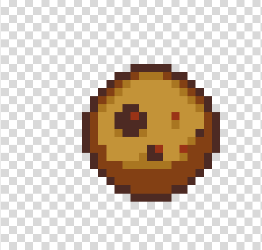
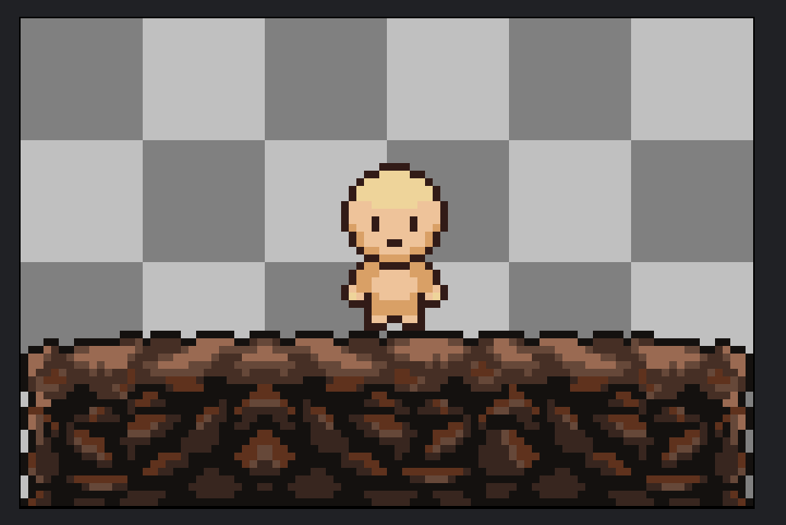
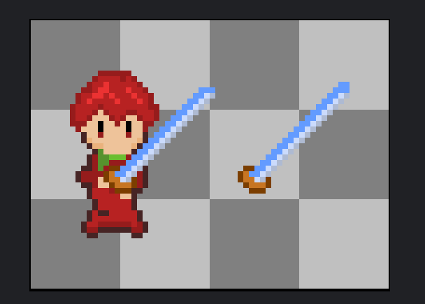

# 2024 年 3 月

### 3 月 6 號

第一次嘗試畫 Pixel Art。傷眼睛就不放了 XD

### 3 月 ? 號 (不太記得了)

看到這部影片蠻有感的。[how to pick better indie game ideas](https://www.youtube.com/watch?v=_4tBL5uTosA&list=LL&index=11&t=6s&ab_channel=GameCourier)。做遊戲要會的技能真的太多了！某些很想做的遊戲想法在現階段能力或許無法實現。在那之前，先從一些相對容易又有興趣的主題開始，邊做邊學習。過程或許會感覺到無聊，拾回熱情，堅持目標，繼續堅持下去！

### 3 月 16 號

觀摩 Pixilart 網站素材庫畫個小餅乾 :

### 3 月 18 號

買了 Aseprite 像素畫軟體，模仿 Los-muteki 大大畫了土地跟人 :

### 3 月 19 號

嘗試自己畫一些東西，是勇者！

